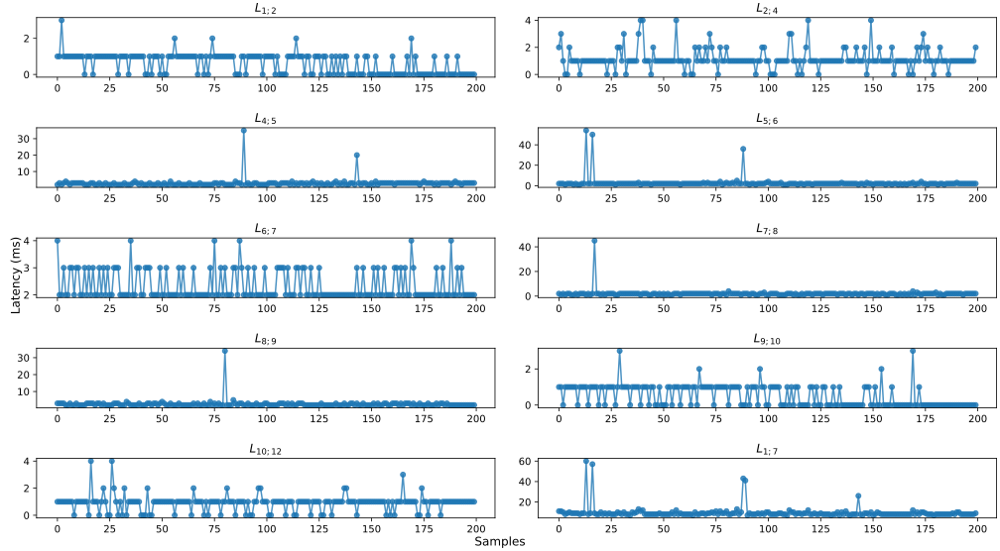
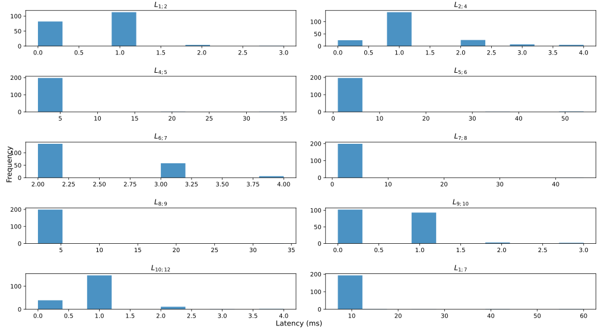
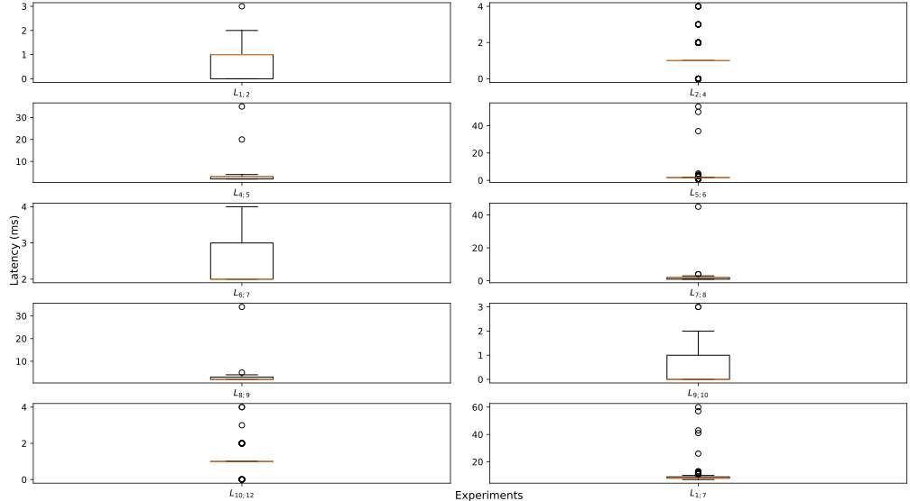

# Doctoral Sandwich Program Abroad (DSPA)  

This work integrates the plug-and-produce architecture (PnPr) from UNESP, with the manufacturing plant that has a legacy architecture, present at the UNIBS laboratory in Brescia.  

 
## Deploy diagram


## Sequence diagram


## PLC Siemens 
[Program](./siemens/program.txt)

## Moleculer Services
[Services](./services/)

## Composer Node-RED  

The values ​​of the Timestamps, T1, T3, T5, T6, T7, T8, T9 and T11 are collected in Node-Red, PLC and services and exported via HTTP API in Node-Red, where they are saved in the [experiments](./experiments/) folder following the standard yyyy-mm-dd-hhmm.txt.  

The other Timestamps, T2, T4, T10 and T12 are collected by Sniffer and saved with the help of Wireshark by selecting the Ethernet adapter in use, using the command for example `sudo tcpdump -i eth0 -w capture.pcap`. This data was also saved in the [experiments](./experiments/) folder following the standard yyyy-mm-dd-hhmm.pcap.  

### Flow 1  

  

### Flow 2  

  

### Flow 3  

  


## Statistical  

The [python program](./python/ricardo_moleculer_comm.py) calculates the △T (ms) between the raw timestamps (UTC) at [experiments](./experiments/)  collected in Node-Red, Industrial PC and Sniffer, all sync with NTP device, where at the end generates a histogram and boxplot.  

PLC (T3 and T11) times were disregarded in the statistical calculations and construction of the graphs, as it was not possible to synchronize with the other devices. 

### Run Python Program  

```bash
# install python
sudo apt install python3
# install package manager
sudo apt install python3-pip
# install virtual environment creator to install packages
sudo apt install python3-venv
# Create a project folder
mkdir python
# Create the main code
nano ricardo_moleculer_comm.py
# Create a virtual environment
python3 -m venv myenv
# Activate the virtual environment 
source myenv/bin/activate
# Install the packages
pip install pandas
# Generate the requirements.txt
pip freeze > requirements.txt
# Install dependencies from requirements.txt
pip install -r requirements.txt
# Run the Code and then save the images manually.
python ricardo_moleculer_comm.py
# Disable the virtual environment
deactivate
```
 
## Graphs  

### Plot  

  

### Histogram  

  

### Box Plot  

  

## Samples (Raw format)  

[raw](./experiments/2024-07-31/2024-07-31-09-27.xlsx)  

## Conclusion  

Article  

## Authors  

Ricardo  
Massimiliano  
Paolo  
Eduardo  


