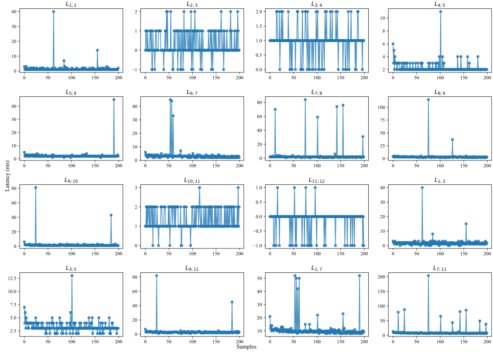

# Doctoral Sandwich Program Abroad (DSPA) 
This work integrates the plug-and-produce architecture (PnPr) from UNESP, with the manufacturing plant that has a legacy architecture, present at the UNIBS laboratory in Brescia. The goal is to provide information regarding an AAS format manufacturing plant pressure sensor using PNPR architecture, measuring your reading and writing times to see if it meets the minimum requirements of the industrial standard. 
 
## Overview
Initially a bench test was done before going directly to the manufacturing plant.An industrial computer was used containing Node-Red, Sensor Service, Transporter Nats, API Service. A PLC S7 was used.NTP Server hardware was used for Sync clock. Sniffer hardware was used to get all packages and attach a timestamp. The left diagram collects a simulated value in S7 as if it were a value of a sensor, and replicates this value to the PNPR architecture writing in the sensor service.The right diagram, read the sensor value in the sensor service, and writes in S7.All tests were done with Ethernet cable, using for messaging, Transporter Nats or S7 protocol. 

 
## Deploy diagram


## Sequence diagram


## PLC Siemens 
[Program](./siemens/program.txt)

## Moleculer Services
[Services](./services/)

## Composer Node-RED
[Flows](./node-red/flows/composer-v1.0.0.json)
The values ​​of the Timestamps, T1, T3, T5, T6, T7, T8, T9 and T11 are collected in Node-Red, PLC and services and exported via HTTP API in Node-Red, where they are saved in the [experiments](./experiments/) folder following the standard yyyy-mm-dd-hhmm.txt.
The other Timestamps, T2, T4 and T10 are collected by Sniffer and saved with the help of Wireshark by selecting the Ethernet adapter in use, using the command for example `sudo tcpdump -i eth0 -w capture.pcap`. This data was also saved in the [experiments](./experiments/) folder following the standard yyyy-mm-dd-hhmm.pcap.

[flow-1](./node-red/flow-1.png)
[flow-2](./node-red/flow-2.png)
[flow-3](./node-red/flow-3.png)


## Statistical
The [python program](./python/ricardo_moleculer_comm.py) calculates the △T (ms) between the raw timestamps (UTC) at [experiments](./experiments/)  collected in Node-Red, Industrial PC and Sniffer, all sync with NTP device, where at the end generates a histogram and boxplot.

```bash
# install python
sudo apt install python3
# install package manager
sudo apt install python3-pip
# install virtual environment creator to install packages
sudo apt install python3-venv

# Create a project folder
mkdir python
# Create the main code
nano ricardo_moleculer_comm.py
# Create a virtual environment
python3 -m venv myenv
# Activate the virtual environment 
source myenv/bin/activate
# Install the packages
pip install pandas
# Generate the requirements.txt
pip freeze > requirements.txt
# Install dependencies from requirements.txt
pip install -r requirements.txt

# Run the Code and then save the images manually.
python ricardo_moleculer_comm.py

# Disable the virtual environment
deactivate
```
 
## Graphs

  

 
  

 
  

## Samples (Raw format)
[raw](./experiments/2024-06-19/2024-06-19-1449.txt.xlsx)

## Conclusion
Article

## Authors
Ricardo  
Massimiliano  
Paolo  
Eduardo  


